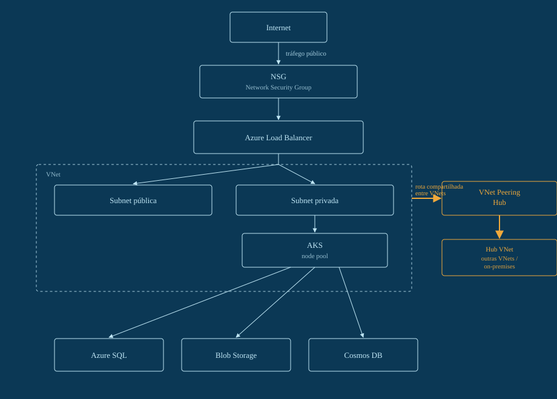

# Arquitetura Azure — Rede, Kubernetes e Dados de Ponta a Ponta

Da VNet ao AKS: firewall, load balancer, peering com o hub e as três camadas de dados (relacional, objetos e NoSQL), com o Terraform de cada etapa e o passo a passo equivalente pelo Portal do Azure.

## Terraform

A pasta [`terraform/`](terraform/) tem os 9 arquivos na ordem de `apply`:

1. `01-main.tf`
2. `02-network.tf`
3. `03-firewall.tf`
4. `04-loadbalancer.tf`
5. `05-peering.tf`
6. `06-aks.tf`
7. `07-sql.tf`
8. `08-storage.tf`
9. `09-cosmosdb.tf`

## 01. Rede

O resource group e a VNet são a base de tudo: todo recurso abaixo referencia um dos dois.

> Portal Azure → Resource groups → Create

**Passos pelo portal:**
1. Na busca do portal, digite `Resource groups` → `+ Create`.
2. Subscription: a sua. Resource group: `rg-workload-prod`. Region: `Brazil South`.
3. `Review + create` → `Create`.
4. Na busca, digite `Virtual networks` → `+ Create`.
5. Aba *Basics*: Resource group `rg-workload-prod`, nome `vnet-workload-prod`, Region `Brazil South`.
6. Aba *IP Addresses*: apague o range padrão e adicione `10.20.0.0/16` como address space.
7. `Review + create` → `Create`.

## 02. Subnets

Uma subnet pública recebe o tráfego do Load Balancer; a privada isola o AKS e os serviços de dados.

> Portal Azure → vnet-workload-prod → Subnets

**Passos pelo portal:**
1. Abra a VNet criada → menu lateral `Subnets` → `+ Subnet`.
2. Nome `snet-public`, Subnet address range `10.20.1.0/24` → `Save`.
3. `+ Subnet` de novo → nome `snet-private`, range `10.20.2.0/24` → `Save`.
4. Confirme que as duas aparecem na lista de subnets da VNet antes de seguir.

## 03. Firewall

O NSG aplica regras de entrada/saída à subnet privada, onde o AKS vai rodar.

> Portal Azure → Network security groups → Create

**Passos pelo portal:**
1. Busque `Network security groups` → `+ Create`.
2. Resource group `rg-workload-prod`, nome `nsg-private`, Region `Brazil South` → `Review + create` → `Create`.
3. Abra o NSG criado → `Outbound security rules` → `+ Add`.
4. Destination port ranges `443`, Protocol `TCP`, Action `Allow`, Priority `100`, Name `allow-aks-egress-443` → `Add`.
5. Menu lateral `Subnets` do NSG → `+ Associate` → escolha a VNet `vnet-workload-prod` e a subnet `snet-private`.

## 04. Load Balancer

Recebe o tráfego pela subnet pública e encaminha para o pool de backend do AKS na porta 443.

> Portal Azure → Load balancers → Create

**Passos pelo portal:**
1. Busque `Load balancers` → `+ Create`.
2. Resource group `rg-workload-prod`, nome `lb-public`, Region `Brazil South`, Type `Public`, SKU `Standard`.
3. Aba *Frontend IP configuration* → `+ Add` → nome `frontend`, associe um IP público novo.
4. Aba *Backend pools* → `+ Add` → nome `aks-pool`, associado à `vnet-workload-prod`.
5. Aba *Inbound rules* → `+ Add a load balancing rule` → nome `https`, Port `443`, Backend port `443`, Backend pool `aks-pool`.
6. `Review + create` → `Create`.

## 05. VNet Peering — Hub

Uma VNet hub central e o peering bidirecional que dá à VNet do workload uma rota para outras VNets e para o on-premises.

> Portal Azure → Virtual networks → Peerings

**Passos pelo portal:**
1. Crie uma segunda VNet do mesmo jeito do passo 01: nome `vnet-hub`, address space `10.10.0.0/16`, mesma region.
2. Abra `vnet-workload-prod` → menu lateral `Peerings` → `+ Add`.
3. Peering link name (local) `spoke-to-hub`; do lado remoto escolha a `vnet-hub`; deixe `Allow forwarded traffic` marcado se for usar NVA depois → `Add`.
4. Abra `vnet-hub` → `Peerings` → `+ Add` → peering link name `hub-to-spoke`, remoto `vnet-workload-prod` → `Add`.
5. Confirme que o status dos dois peerings fica `Connected` nas duas pontas.

## 06. Kubernetes gerenciado

O AKS sobe na subnet privada, com identidade gerenciada e CNI Azure para IP nativo dos pods.

> Portal Azure → Kubernetes services → Create

**Passos pelo portal:**
1. Busque `Kubernetes services` → `Create` → `Create a Kubernetes cluster`.
2. Aba *Basics*: Resource group `rg-workload-prod`, Cluster name `aks-workload-prod`, Region `Brazil South`.
3. Aba *Node pools*: node pool `system`, node size `Standard_D4s_v5`, node count `3`.
4. Aba *Networking*: Network configuration `Azure CNI`, Virtual network `vnet-workload-prod`, Cluster subnet `snet-private`, Load balancer SKU `Standard`.
5. Aba *Networking* → Network policy: deixe padrão, ou `Azure` se quiser políticas nativas.
6. `Review + create` → `Create` (a criação leva alguns minutos).

## 07. Banco relacional

Azure SQL para dados transacionais da aplicação, isolado por firewall de servidor.

> Portal Azure → SQL databases → Create

**Passos pelo portal:**
1. Busque `SQL databases` → `+ Create`.
2. Resource group `rg-workload-prod`, Database name `workload-db`.
3. Server: `Create new` → nome `sql-workload-prod`, Location `Brazil South`, Authentication `Use SQL authentication`, login `sqladmin` + senha.
4. Aba *Compute + storage* → escolha o tier `Standard S1`.
5. Aba *Networking*: Connectivity method `Private endpoint` (ou `Public endpoint` com firewall restrito, se ainda não tiver Private Link configurado).
6. `Review + create` → `Create`.

## 08. Object Storage

Blob Storage para arquivos e assets estáticos, com replicação zonal.

> Portal Azure → Storage accounts → Create

**Passos pelo portal:**
1. Busque `Storage accounts` → `+ Create`.
2. Resource group `rg-workload-prod`, Storage account name `stworkloadprod`, Region `Brazil South`.
3. Performance `Standard`, Redundancy `Zone-redundant storage (ZRS)` → `Review + create` → `Create`.
4. Abra a conta criada → menu lateral `Containers` → `+ Container`.
5. Nome `assets`, Public access level `Private` → `Create`.

## 09. NoSQL

Cosmos DB via Table API — o equivalente mais próximo do DynamoDB — para dados de baixa latência e alta escala.

> Portal Azure → Azure Cosmos DB → Create

**Passos pelo portal:**
1. Busque `Azure Cosmos DB` → `+ Create` → escolha a API `Table`.
2. Resource group `rg-workload-prod`, Account name `cosmos-workload-prod`, Location `Brazil South`, Capacity mode `Provisioned throughput`.
3. Aba *Global Distribution*: deixe `Geo-Redundancy` desligado por padrão nesse ambiente.
4. `Review + create` → `Create`.
5. Abra a conta criada → `Tables` → `+ New Table` → Table id `sessions`.

## Aviso

Ordem de criação: rede → subnets → firewall → load balancer → peering → AKS → dados — a mesma sequência da versão em Terraform, só que clicada.

Os menus e assistentes do portal mudam de nome e posição com o tempo; a lógica e a ordem dos passos continuam válidas mesmo que um rótulo específico tenha se movido.
